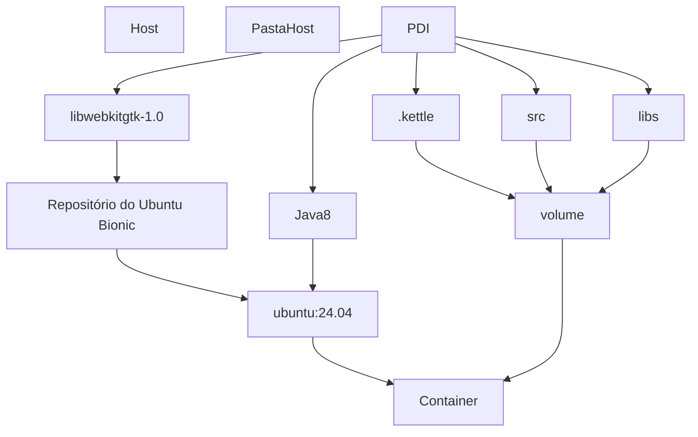

# Dockerizando PDI

## Dependências

graph LR;
flowchart TD


## Componentes

### Ubuntu
```bash
docker pull ubuntu:24.04
docker pull docker.io/ubuntu@sha256:2e863c44b718727c860746568e1d54afd13b2fa71b160f5cd9058fc436217b30
```